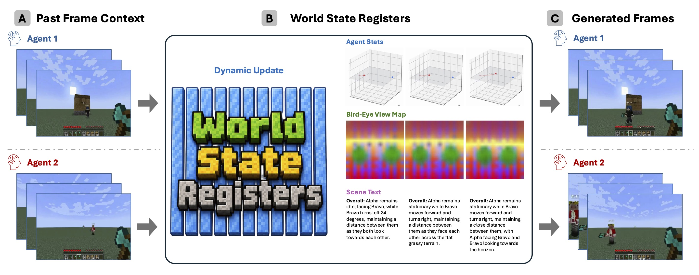
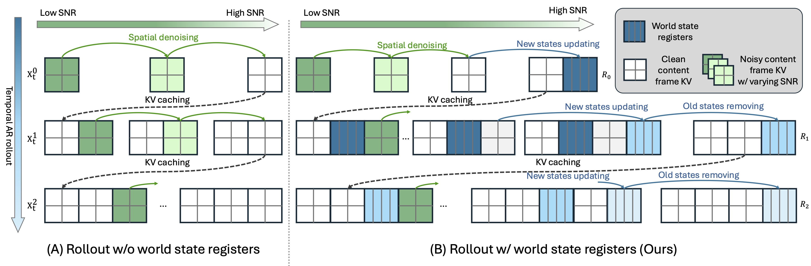

<style>
  body {
    background: #f7f8fb;
  }

  .post-header {
    max-width: 800pt;
    margin: 0 auto;
    padding: 2rem 1.5rem 0;
    background: rgba(255, 255, 255, 0.98);
    border: 1px solid rgba(30, 41, 59, 0.08);
    border-bottom: 0;
    border-radius: 8px 8px 0 0;
    box-shadow: 0 8px 24px rgba(15, 23, 42, 0.045);
  }

  .post > article > .research-section {
    background: rgba(255, 255, 255, 0.98);
    border: 1px solid rgba(30, 41, 59, 0.08);
    border-radius: 8px;
    box-shadow: 0 8px 24px rgba(15, 23, 42, 0.045);
    margin-top: 1.35rem;
    margin-bottom: 1.35rem;
    padding: 1.25rem 1.5rem;
  }

  .post > article > .research-section:first-child {
    border-top: 0;
    border-radius: 0 0 8px 8px;
    box-shadow: 0 14px 26px rgba(15, 23, 42, 0.045);
    margin-top: -0.5rem;
    padding-top: 0;
  }

  .post > article > .research-section h2 {
    border-bottom: 1px solid rgba(30, 41, 59, 0.09);
    margin-top: 0.2rem;
    margin-bottom: 1.15rem;
    padding-bottom: 0.55rem;
  }

  .post-header .post-title {
    font-size: 2.25rem;
    line-height: 1.16;
    margin-bottom: 1.35rem;
  }

  .post-header > .col-12 {
    margin-bottom: 0.35rem !important;
  }

  .post-header > .col-12[align="center"] {
    display: none;
  }

  .post-header h6 a:nth-of-type(1) b,
  .post-header h6 a:nth-of-type(2) b {
    font-weight: 900 !important;
  }

  .wweaver-hero-image {
    margin-top: 1.15rem;
  }

  .wweaver-hero-image img,
  .wweaver-media-frame img,
  .wweaver-gallery video {
    background: #fff;
    border: 1px solid rgba(30, 41, 59, 0.1);
    border-radius: 8px;
    box-shadow: 0 6px 18px rgba(15, 23, 42, 0.06);
  }

  .wweaver-tldr {
    background: #f8fbff;
    border: 1px solid rgba(39, 116, 174, 0.13);
    border-left: 3px solid rgba(39, 116, 174, 0.55);
    border-radius: 8px;
    margin: 1.15rem auto 0;
    padding: 1rem 1.15rem;
  }

  .wweaver-tldr h3 {
    margin-top: 0;
    margin-bottom: 0.6rem;
  }

  .wweaver-equal-note {
    color: #444;
    font-size: 1rem;
    margin: 0 0 0.45rem;
    text-align: center;
  }

  .wweaver-resource-links {
    color: var(--global-text-color);
    font-size: 1.15rem;
    margin: 0.2rem 0 0.4rem;
    text-align: center;
  }

  .wweaver-resource-links a {
    color: var(--global-theme-color);
    font-weight: 700;
  }

  .wweaver-resource-links a:hover,
  .wweaver-resource-links a:focus {
    text-decoration: underline;
  }

  html[data-theme='dark'] body {
    background: #101317;
  }

  html[data-theme='dark'] .post-header,
  html[data-theme='dark'] .post > article > .research-section {
    background: rgba(24, 27, 32, 0.98);
    border-color: rgba(255, 255, 255, 0.1);
    box-shadow: 0 10px 26px rgba(0, 0, 0, 0.28);
  }

  html[data-theme='dark'] .post > article > .research-section h2 {
    border-bottom-color: rgba(255, 255, 255, 0.12);
  }

  html[data-theme='dark'] .wweaver-hero-image img,
  html[data-theme='dark'] .wweaver-media-frame img,
  html[data-theme='dark'] .wweaver-gallery video {
    background: #181b20;
    border-color: rgba(255, 255, 255, 0.12);
    box-shadow: 0 8px 24px rgba(0, 0, 0, 0.32);
  }

  html[data-theme='dark'] .wweaver-tldr {
    background: rgba(39, 116, 174, 0.11);
    border-color: rgba(139, 184, 232, 0.2);
    border-left-color: rgba(139, 184, 232, 0.65);
  }

  html[data-theme='dark'] .wweaver-equal-note {
    color: #bcc4cf;
  }

  @media (max-width: 768px) {
    .post-header {
      padding: 1.25rem 1rem 0;
    }

    .post > article > .research-section {
      padding: 1rem;
    }

    .post-header .post-title {
      font-size: 1.55rem;
    }
  }
</style>

<p class="wweaver-equal-note">
  <sup>*</sup>Equal contribution.
</p>

<p class="wweaver-resource-links">
  <a href="https://arxiv.org/pdf/2607.21594"><b>Paper</b></a> | <a href="https://github.com/VAIL-UCLA/WorldWeaver"><b>Code</b></a> | <a href="https://vail-ucla.github.io/worldweaver/"><b>Project</b></a>
</p>

<div class="img-container wweaver-hero-image" style="width: 100%; margin: 0 auto;">
  
</div>

<div class="wweaver-tldr">
    <h3 style="text-align: center">TL;DR</h3>
    <p style="margin-bottom: 0;">
      <strong>WorldWeaver</strong> (<strong>W<sup>2</sup></strong>) is a streaming multi-agent video diffusion model that explicitly models persistent world states with <strong>world state registers</strong> (WSR): learnable tokens that store shared world information, track individual agent status, and are dynamically updated after each generated chunk. These registers are grounded with supervision spanning individual agent statistics, a global bird's-eye view, and scene text. We further improve the architecture with a Mixture-of-Transformers design that uses separate weights for world-state modeling and visual frame modeling.
    </p>
</div>

<!--research-section-splitter-->

## Gallery

<style>
  .wweaver-gallery {
    position: relative;
    width: 82%;
    margin: 0 auto;
    aspect-ratio: 1562 / 1080;
  }

  .wweaver-gallery video {
    position: absolute;
    inset: 0;
    width: 100%;
    height: 100%;
    object-fit: contain;
    opacity: 0;
    transition: opacity 0.45s ease;
    pointer-events: none;
    z-index: 0;
  }

  .wweaver-gallery video.active {
    opacity: 1;
    pointer-events: auto;
    z-index: 1;
  }

  .wweaver-gallery-nav {
    position: absolute;
    top: 50%;
    transform: translateY(-50%);
    z-index: 2;
    display: flex;
    align-items: center;
    justify-content: center;
    width: 44px;
    height: 44px;
    border: 0;
    background: transparent;
    color: var(--global-theme-color);
    font-size: 30px;
    line-height: 1;
    cursor: pointer;
  }

  .wweaver-gallery-nav:hover,
  .wweaver-gallery-nav:focus {
    color: var(--global-hover-color);
    outline: none;
  }

  .wweaver-gallery-prev {
    left: -54px;
  }

  .wweaver-gallery-next {
    right: -54px;
  }

  .wweaver-gallery-pagination {
    display: flex;
    justify-content: center;
    align-items: center;
    gap: 8px;
    margin-top: 0.8rem;
  }

  .wweaver-gallery-dot {
    width: 8px;
    height: 8px;
    padding: 0;
    border: 0;
    border-radius: 50%;
    background: rgba(128, 128, 128, 0.35);
    cursor: pointer;
  }

  .wweaver-gallery-dot.active {
    background: var(--global-theme-color);
  }

  html[data-theme='dark'] .wweaver-gallery-dot {
    background: rgba(255, 255, 255, 0.28);
  }

  html[data-theme='dark'] .wweaver-gallery-dot.active {
    background: var(--global-theme-color);
  }

  .wweaver-results-table {
    overflow-x: visible;
    margin-top: 1rem;
    margin-bottom: 1.25rem;
  }

  .wweaver-results-table table {
    width: 94%;
    margin: 0 auto;
    table-layout: fixed;
    border-collapse: collapse;
    font-size: 0.74rem;
    line-height: 1.2;
  }

  .wweaver-results-table th,
  .wweaver-results-table td {
    padding: 0.22rem 0.18rem;
    text-align: center;
    vertical-align: middle;
    word-break: normal;
  }

  .wweaver-results-table th:first-child,
  .wweaver-results-table td:first-child {
    width: 15%;
    text-align: left;
  }

  .wweaver-results-table td.sub-variant {
    padding-left: 1.1rem;
  }

  .wweaver-results-table .metric-group {
    border-bottom: 1px solid var(--global-divider-color);
    font-weight: 700;
  }

  .wweaver-results-table .metric-subhead {
    font-weight: 600;
  }

  .wweaver-results-table .world-score {
    width: 9%;
  }

  .wweaver-results-table .highlight-row {
    background: rgba(39, 116, 174, 0.07);
  }

  html[data-theme='dark'] .wweaver-results-table .highlight-row {
    background: rgba(139, 184, 232, 0.11);
  }

  @media (max-width: 768px) {
    .wweaver-gallery {
      width: 88%;
    }

    .wweaver-gallery-prev {
      left: -38px;
    }

    .wweaver-gallery-next {
      right: -38px;
    }

    .wweaver-results-table table {
      font-size: 0.62rem;
    }

    .wweaver-results-table th,
    .wweaver-results-table td {
      padding: 0.18rem 0.08rem;
    }
  }

  .wweaver-equation {
    overflow-x: auto;
    -webkit-overflow-scrolling: touch;
    text-align: center;
    margin: 1rem 0;
  }
</style>

<div class="wweaver-gallery">
  <video class="wweaver-gallery-slide active" data-wweaver-slide="0" muted autoplay playsinline controls preload="auto">
    <source src="../assets/projects/worldweaver/videos/sample_00.mov">
    Your browser does not support the video tag.
  </video>
  <video class="wweaver-gallery-slide" data-wweaver-slide="1" muted playsinline preload="auto">
    <source src="../assets/projects/worldweaver/videos/sample_01.mov">
    Your browser does not support the video tag.
  </video>
  <video class="wweaver-gallery-slide" data-wweaver-slide="2" muted playsinline preload="auto">
    <source src="../assets/projects/worldweaver/videos/sample_02.mov">
    Your browser does not support the video tag.
  </video>
  <button id="wweaver-gallery-prev" class="wweaver-gallery-nav wweaver-gallery-prev" type="button" aria-label="Previous sample">&#10094;</button>
  <button id="wweaver-gallery-next" class="wweaver-gallery-nav wweaver-gallery-next" type="button" aria-label="Next sample">&#10095;</button>
</div>

<div class="wweaver-gallery-pagination" aria-label="Gallery sample selector">
  <button class="wweaver-gallery-dot active" type="button" data-wweaver-gallery-index="0" aria-label="Show sample 1"></button>
  <button class="wweaver-gallery-dot" type="button" data-wweaver-gallery-index="1" aria-label="Show sample 2"></button>
  <button class="wweaver-gallery-dot" type="button" data-wweaver-gallery-index="2" aria-label="Show sample 3"></button>
</div>

<script>
  (function() {
    const gallery = document.querySelector(".wweaver-gallery");
    if (!gallery) return;

    const slides = Array.prototype.slice.call(gallery.querySelectorAll(".wweaver-gallery-slide"));
    const prevBtn = document.getElementById("wweaver-gallery-prev");
    const nextBtn = document.getElementById("wweaver-gallery-next");
    const dots = document.querySelectorAll("[data-wweaver-gallery-index]");
    if (!slides.length || !prevBtn || !nextBtn) return;

    let idx = 0;
    let advanceTimer = null;

    function show(next) {
      if (advanceTimer) {
        clearTimeout(advanceTimer);
        advanceTimer = null;
      }
      next = (next + slides.length) % slides.length;
      slides.forEach(function(video, i) {
        const isActive = i === next;
        video.classList.toggle("active", isActive);
        if (isActive) {
          video.setAttribute("controls", "");
          try { video.currentTime = 0; } catch (e) {}
          const playPromise = video.play();
          if (playPromise && typeof playPromise.catch === "function") playPromise.catch(function() {});
        } else {
          video.removeAttribute("controls");
          video.pause();
        }
      });
      dots.forEach(function(dot, i) {
        dot.classList.toggle("active", i === next);
      });
      idx = next;
    }

    prevBtn.addEventListener("click", function() {
      show(idx - 1);
    });
    nextBtn.addEventListener("click", function() {
      show(idx + 1);
    });
    dots.forEach(function(dot) {
      dot.addEventListener("click", function() {
        show(Number(dot.getAttribute("data-wweaver-gallery-index")) || 0);
      });
    });
    slides.forEach(function(video, i) {
      video.addEventListener("ended", function() {
        if (i !== idx) return;
        advanceTimer = setTimeout(function() {
          show(idx + 1);
        }, 1000);
      });
    });
  })();
</script>

The rollout examples show synchronized two-player Minecraft generation. WorldWeaver maintains a shared world-state representation so future chunks can condition on persistent state rather than relying only on a limited window of recent frames.

<!--research-section-splitter-->

## Method Overview

<div class="img-container wweaver-media-frame" style="width: 100%; margin: 0 auto;">
  
</div>

Standard streaming autoregressive diffusion models denoise each new frame from a local frame KV cache. This makes rollout practical, but the model must repeatedly re-infer world information from recent frames, and the stored context remains entangled with visual tokens.

<strong>WorldWeaver</strong> augments this pipeline with <strong>world state registers</strong> (WSR): persistent register tokens that carry global scene information and individual agent status across rollout steps. After each generated chunk, the model commits an updated register, removes stale state, and uses the latest register to condition the next frame generation.

At each rollout step, the model updates the register from the previous register, the local context window, and the current action, then uses the committed register to generate the next frame:

<div class="wweaver-equation">
\[
\mathbf{r}_i=G_\theta(\mathbf{r}_{i-1},\mathbf{x}_{i-W+1},\ldots,\mathbf{x}_i,a_i),\qquad
p_\theta(\mathbf{x}_{i+1}\mid \mathbf{x}_{i-W+1},\ldots,\mathbf{x}_i,a_{i+1},\mathbf{r}_i).
\]
</div>

During training, WorldWeaver interleaves frame/context tokens and register groups as <code>[C1, R1, C2, R2, ...]</code>. The causal mask makes the rollout causal at the state level: frame tokens attend to the local window and the latest committed register, while each register query attends to the local context ending at its commit step and the immediately preceding register.

To keep world-state modeling from competing with pixel generation, WorldWeaver adopts a <strong>Mixture-of-Transformers (MoT)</strong> backbone: register tokens and frame tokens are routed through role-specific weight branches, while joint self-attention over the interleaved sequence is preserved so the two pathways keep exchanging information at every step. This separation matters most once the registers carry richer supervised semantics, where a dense backbone that shares parameters across both roles begins to degrade.

WorldWeaver is trained with a three-stage curriculum: (1) <strong>Bidirectional training</strong> adapts a single-player video prior into a synchronized multi-agent teacher; (2) <strong>Causal training</strong> converts the teacher into a causal student with the WSR pathway and register supervision; and (3) <strong>Self-forcing</strong> rolls out the student on its own generated frames and committed registers, exposing state drift together with frame drift to close the train-test gap over long horizons.

<!--research-section-splitter-->

## Grounding the World State

A core question is not only how to store state, but what the state should represent. WorldWeaver grounds each committed register with auxiliary decoders that make the hidden world state inspectable: per-agent simulator statistics, a global bird's-eye view, and scene text. These heads are used during training and discarded at inference, so the supervision does not increase rollout cost.

The supervision signals encourage the register to preserve complementary aspects of the world:

- <strong>Agent states:</strong> position, velocity, and orientation give the register explicit per-agent motion targets.
- <strong>BEV layout:</strong> bird's-eye-view supervision exposes allocentric geometry shared by both players.
- <strong>Scene text:</strong> language targets ask registers to retain categories, attributes, and semantic state.

<div class="img-container wweaver-media-frame" style="width: 78%; margin: 1rem auto 0;">
  
</div>

<!--research-section-splitter-->

## Experiments

We ablate the supervision signals used to ground the world state registers. The aggregate <strong>world score</strong> combines visual quality and logical correctness; higher is better.

<div class="table-container wweaver-results-table">
  <table>
    <thead>
      <tr>
        <th rowspan="2">Variant</th>
        <th class="metric-group" colspan="2">Movement</th>
        <th class="metric-group" colspan="2">Grounding</th>
        <th class="metric-group" colspan="2">Memory</th>
        <th class="metric-group" colspan="2">Building</th>
        <th class="metric-group" colspan="2">Consistency</th>
        <th rowspan="2" class="world-score">World<br>Score ↑</th>
      </tr>
      <tr>
        <th class="metric-subhead">VLM ↑</th>
        <th class="metric-subhead">FID ↓</th>
        <th class="metric-subhead">VLM ↑</th>
        <th class="metric-subhead">FID ↓</th>
        <th class="metric-subhead">VLM ↑</th>
        <th class="metric-subhead">FID ↓</th>
        <th class="metric-subhead">VLM ↑</th>
        <th class="metric-subhead">FID ↓</th>
        <th class="metric-subhead">VLM ↑</th>
        <th class="metric-subhead">FID ↓</th>
      </tr>
    </thead>
    <tbody>
      <tr>
        <td>Baseline</td>
        <td>79.7</td>
        <td>43.3</td>
        <td>81.3</td>
        <td>37.2</td>
        <td>43.8</td>
        <td>61.2</td>
        <td>9.4</td>
        <td>83.4</td>
        <td>57.8</td>
        <td>110.7</td>
        <td>81.0</td>
      </tr>
      <tr>
        <td>Registers only</td>
        <td>90.6</td>
        <td>43.2</td>
        <td>81.3</td>
        <td>44.3</td>
        <td>62.5</td>
        <td>66.1</td>
        <td>21.9</td>
        <td>84.3</td>
        <td>62.5</td>
        <td>101.9</td>
        <td>93.8</td>
      </tr>
      <tr>
        <td class="sub-variant">+ Agent stats</td>
        <td>95.3</td>
        <td>41.0</td>
        <td>59.4</td>
        <td>45.5</td>
        <td>56.3</td>
        <td>60.1</td>
        <td>9.4</td>
        <td>80.8</td>
        <td>75.0</td>
        <td>107.9</td>
        <td>88.1</td>
      </tr>
      <tr>
        <td class="sub-variant">+ BEV</td>
        <td>82.8</td>
        <td>39.1</td>
        <td>96.9</td>
        <td>40.7</td>
        <td>46.9</td>
        <td>64.7</td>
        <td>31.3</td>
        <td>74.2</td>
        <td>71.9</td>
        <td>103.4</td>
        <td>102.4</td>
      </tr>
      <tr>
        <td class="sub-variant">+ Scene text</td>
        <td>85.9</td>
        <td>40.2</td>
        <td>84.4</td>
        <td>38.4</td>
        <td>62.5</td>
        <td>62.1</td>
        <td>25.0</td>
        <td>78.8</td>
        <td>73.4</td>
        <td>101.6</td>
        <td>103.2</td>
      </tr>
      <tr class="highlight-row">
        <td class="sub-variant"><strong>+ All</strong></td>
        <td>82.8</td>
        <td>34.0</td>
        <td>93.8</td>
        <td>36.8</td>
        <td>46.9</td>
        <td>64.8</td>
        <td>28.1</td>
        <td>75.9</td>
        <td>76.6</td>
        <td>100.7</td>
        <td>105.1</td>
      </tr>
    </tbody>
  </table>
</div>

Even without explicit targets, adding registers already lifts the world score from 81.0 to 93.8, because they give the model a dedicated slot to carry cross-agent information instead of recomputing it from the local window at every step. Explicit supervision then determines what that state encodes: the bird's-eye view is the strongest single signal since it grounds global 3D layout, and combining all three signals on the Mixture-of-Transformers backbone yields the full W<sup>2</sup> model at 105.1. Crucially, the largest gains fall on state-sensitive categories such as grounding, building, and consistency, showing that persistent registers improve logical coherence across players and rollout steps rather than visual fidelity alone.

<!--research-section-splitter-->

## Reference

```
@article{mo2026worldweaver,
  title={Streaming Multi-Agent Autoregressive Diffusion Model with World State Registers},
  author={Mo, Sicheng and Li, Yuheng and Leng, Ziyang and Singh, Krishna Kumar and Zhou, Bolei},
  journal={arXiv preprint},
  year={2026}
}
```
